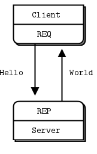
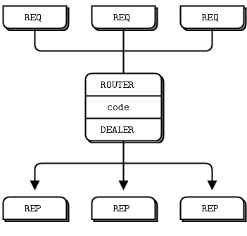

# zmq_exercise
learning zeromq 

## 1.request and reply

* reply为服务端，request为客户端。服务器对客户端的请求进行回应。客户端为主动发起请求，服务器对相应的请求回复设定好的应答。

* reply 对应的模式是 ZMQ_REP,request 对应的模式是ZMQ_REQ

## 2.publish and subscribe

* publish为发布端，subscribe为订阅端。发布端对相应的分类发布相应的信息，只要有新消息存在，就会主动发出消息。订阅端需要主动订阅相应类型的消息，在连接之前的消息如果没有相应的策略进行控制，是无法获取之前已经广播的消息。

* publish 对应的模式是 ZMQ_PUB,subscribe 对应的模式是ZMQ_SUB

## 3.push and pull

* push 和 pull 并不是唯一对应服务端和客户端，服务器即可以进行push 也可以进行 pull，客户端也是一样的。主要的是服务器/客户端是要进行发送消息还是接收消息，发送消息则为push，接收消息则为pull。

* push 对应的模式是 ZMQ_PUSH,pull 对应的模式是ZMQ_PULL

## 4.router and dealer

* router 作为客户端请求的一个接收节点，dealer作为服务器进行处理消息的分配器。对应 N(Client) -> M(Server)这种服务模式，即分布式服务器处理方案。

* router 对应的模式是 ZMQ_PUB,dealer 对应的模式是ZMQ_SUB